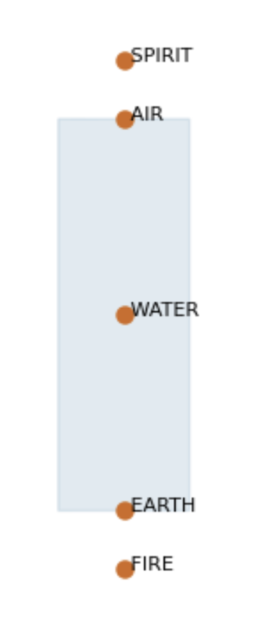
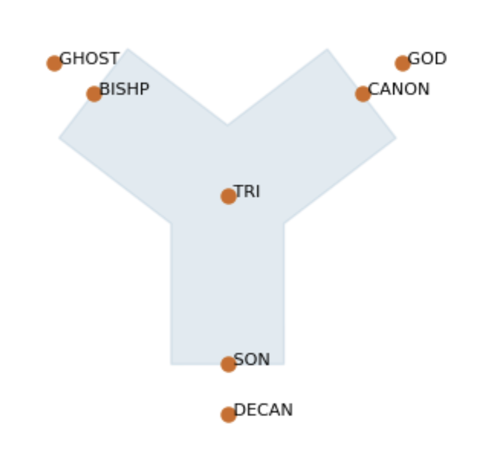
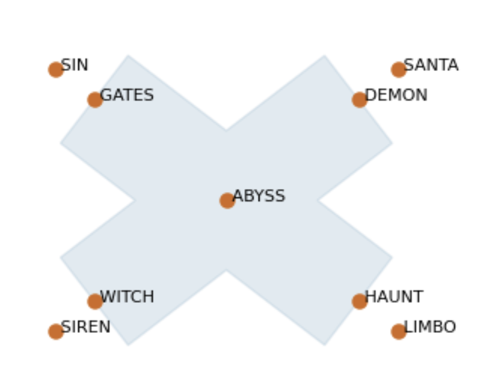
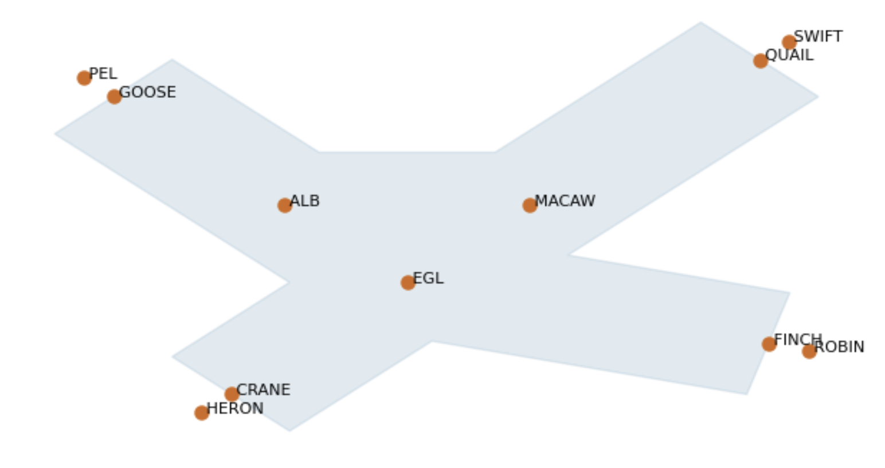
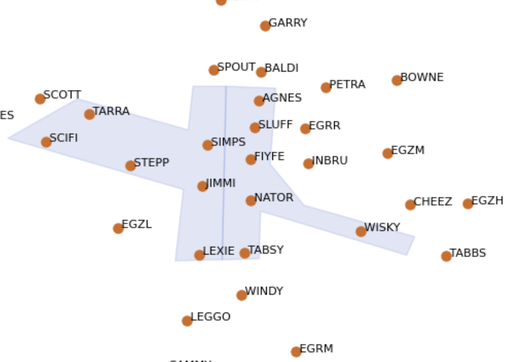

# Welcome to bluebird-dt

The `bluebird-dt` package is a Digital Twin of Air Traffic Control (ATC) scenarios.
The Digital Twin can be used as a sandbox for training and testing *AI Agents* to perform ATC tasks.

## Source code

The auto-generated source code documentation can be found [here](source.md).
## ATC concepts and terminology

In this digital twin, we are controlling **Aircraft** within a **Sector** of **Airspace**, by issuing **Actions**.  

### Aircraft

An **Aircraft** will have (among other attributes):

- a _type_ (i.e. the model of aircraft)
- a position defined by _(latitude, longitude)_ and _flight-level_ (altitude in units of 100ft above mean sea level when the pressure at sea level is 1013.2 mb)
- a _heading_, from 0 to 360 degrees
- a _speed_ (measured in knots or mach)
- a _flight plan_ which includes a _route_

### Sector

A **Sector** is a region of airspace, typically controlled by one Air Traffic Controller (ATCO), which is made up of the concatenation of one or more *Volumes*. Each volume is bounded by a polygon in (lat, lon) space and by upper and lower flight level limits. Sectors may be joined together in a process called "Bandboxing" to give larger Sectors.

### Fix

A **Fix** is a fixed navigational point at a latitude and longitude, with a name.

### Route

A **Route** is a sequence of *Fixes* that an aircraft can follow to get to its destination.

### Airspace

For our purposes, an **Airspace** contains one or more Sectors and a set of Fixes.

### Action

An **Action** is an instruction given to an aircraft, for example:

- change heading to *x* degrees
- climb to flight level *y*
- go directly to Fix *z*
- "Outcomm" (i.e. leave communication with this ATCo and contact the one for the next Sector)

## Provided Airspace

Users can choose between various simulated *Scenarios*, many of which can take place in a chosen *Airspace*.   

The Airspaces included in the `bluebird-dt` digital twin at the moment are:

### I-sector

This is a simple linear sector, with only two entry/exit windows at the North and South ends.

### Y-sector

This Y-shaped sector can have aircraft coming from any of three directions, and converging on the fix in the centre.

### X-sector

The X-sector is essentially two I-sectors at 90 degree angle to one another, crossing over in the centre.  There are numerous possibilities for conflicts arising from aircraft entering from different legs of the sector.

### Xplus-sector

The Xplus-sector is similar to the X-sector, but with an asymmetric cutout, meaning there is a wider region of allowed airspace, and more possible routes.

### Springfield 

The Springfield sector, with its surrounding sectors, is a synthetic airspace that is designed to test agents on many of the challenging situations that could arise in real ATC.

## Scenarios 
See the [scenario manager source code reference](source.md#scenario-manager).

### Two Aircraft

This scenario has two aircraft approaching one another from opposite sides of the sector.   Each aircraft can be a "climber", "descender" or "overflight".
See the [source code reference](source.md#bluebird_dt.scenario_manager.TwoAircraft).

### Regular

The user can specify the total time and the number of aircraft for the scenario, and the aircraft will be emitted from route start points, quasi-regularly spaced out in time.
See the [source code reference](source.md#bluebird_dt.scenario_manager.Regular).

### Custom

This is a more configurable option for generating simple custom scenarios.   The user can specify the total number of aircraft, the balance of climbers, descenders and overfliers, and the generator will spawn aircraft with randomly selected coordinations and speeds.  It is also possible for users to fully customize the scenario, adding aircraft with specified routes, positions, speeds, flight levels and coordinations, entering the airspace at specified times.
See the [source code reference](source.md#bluebird_dt.scenario_manager.Custom).

### Infinite

Unlike the previous scenario generators that run for a specified length of time, the Infinite scenarios will go on indefinitely, with aircraft spawning stochastically at a given average frequency on randomly chosen routes.  Optionally, the user can ramp up the spawning frequency by a set interval after set periods of time, up to a specified maximum frequency.

## Design of the digital twin

The digital twin code consists of:

### Core classes

Representing things like *Aircraft*, *Sector*, *Fix* etc. described above, as well as *Environment*, a container class that holds the current state of all the Aircraft and the Airspace in the simulation.

### Scenario and airspace generators

Code to define simulation scenarios, in very simple artificial sectors, or more complex/realistic airspaces.

### Simulation and event management

Keep track of and evolve the current state of the simulation, including writing to logfiles.

### Predictors

Simulate how aircraft will move from one time step to the next.

### Utility functions

Code to read and write data files, perform geometric calculations etc.

## Installing the software

For installation instructions, see the [BluebirdATC repository README](https://github.com/project-bluebird/BluebirdATC/blob/dev/README.md)

### Versioning

Development of the BluebirdATC Digital Twin is still in early stages, with new features and bug fixes causing breaking changes.
This is why the current versions are still '0.x.x', reflecting that each 'MINOR' version could potentially have breaking changes, following the [semantic versioning](https://semver.org/#spec-item-5) conventions.
On the other hand, 'PATCH' versions are used for bug fixes and non-breaking changes, although they may subtly change the behaviour of the models.

Release notes will include a list of changes, specifying if any are breaking changes.
