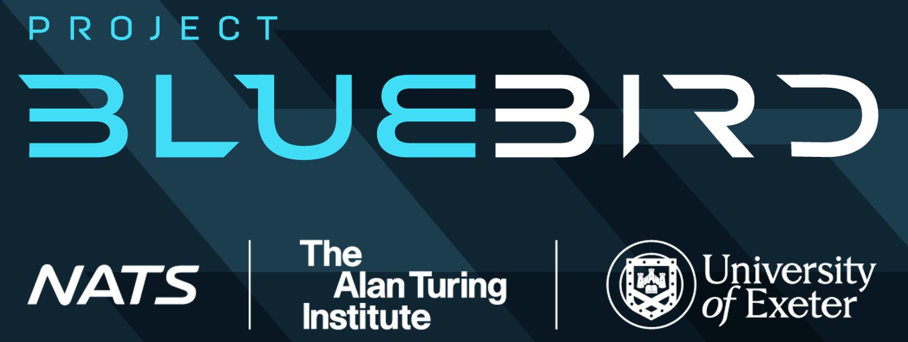

## Project Overview

BluebirdATC is a Digital Twin and Agent Training Environment for Air Traffic Control.

The project is a collaboration between NATS, The University of Exeter, and the Alan Turing Institute.  The goals of the project include:

- Building a Digital Twin of UK airspace.
- Developing AI agents that can perform Air Traffic Control (ATC) within this digital twin environment.
- Safety, trustworthiness and explainability of AI in safety-critical systems such as ATC.

<video id="introVideo" autoplay muted loop playsinline width="1000">
  <source src="assets/InfiniteSpringfield.mp4" type="video/mp4">
</video>

## Package Documentation
The BluebirdATC repo is made up of four packages, `bluebird-dt`, `bluebird-api`, `bluebird-gymnasium`, and `bluebird-hmi`.  Click on the boxes in the section below to see the documentation for each one.

- :material-cube-outline: **bluebird-dt**
  Core digital twin package.
  [Open docs →](bluebird-dt/index.md)

- :material-api: **bluebird-api**
  HTTP interface for the twin.
  [Open docs →](bluebird-api/index.md)

- :material-robot: **bluebird-gymnasium**
  Gym wrapper for training agents.
  [Open docs →](bluebird-gymnasium/index.md)

- :material-monitor: **bluebird-hmi**
  React UI for visualization.
  [Open docs →](bluebird-hmi/index.md)

## General ATC Introduction and Definition of Terms

For a general introduction to ATC and the definition of useful domain-related words and phrases, please visit the [Introduction and Glossary](atc-introduction-and-glossary.md) page.

## Getting Started

Start with the `Examples` tab in these docs for rendered notebook walkthroughs of the Digital Twin and RL training environment. The source notebooks remain in `bluebird-dt/notebooks` and `bluebird-gymnasium/examples` if you want to run or edit them locally.

## References

- **A Probabilistic Digital Twin of UK Airspace**, AIAA SciTech Forum (2026):  https://doi.org/10.48550/arXiv.2601.03113
- **A framework for assuring the accuracy and fidelity of an AI-enabled Digital Twin of en route UK airspace**, AIAA SciTech Forum (2026): https://doi.org/10.48550/arXiv.2601.03120
- **Human-in-the-Loop Testing of AI Agents for Air Traffic Control with a Regulated Assessment Framework**, AIAA SciTech Forum (2026): https://doi.org/10.48550/arXiv.2601.04288
- **Fast Surrogate Models for Adaptive Aircraft Trajectory Prediction in En route Airspace**, AIAA SciTech Forum (2026): https://doi.org/10.48550/arXiv.2601.03075
- **Online Action-Stacking Improves Reinforcement Learning Performance for Air Traffic Control**, AIAA SciTech Forum (2026): https://doi.org/10.48550/arXiv.2601.04287
- **Conditioning Aircraft Trajectory Prediction on Meteorological Data with a Physics-Informed Machine Learning Approach**, AIAA SciTech Forum (2026): https://doi.org/10.48550/arXiv.2601.03152
- **A Future Capabilities Agent for Tactical Air Traffic Control**, AIAA SciTech Forum (2026): https://arxiv.org/abs/2601.04285
- **Towards Transparent AI Agents for Air Traffic Control**, AIAA SciTech Forum (2026): http://dx.doi.org/10.2139/ssrn.6042354
